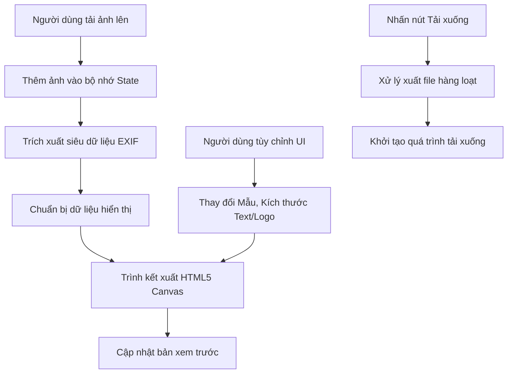

# Kinx's Lab | SOJI Studio - Photo Frame Generator

## Ý Nghĩa Và Mục Đích Của Dự Án

Dự án này là một công cụ web được thiết kế đặc biệt dành cho các nhiếp ảnh gia và những người đam mê nhiếp ảnh. Mục tiêu cốt lõi của ứng dụng là tự động hóa quá trình gắn thông số kỹ thuật (EXIF) và thương hiệu cá nhân vào các bức ảnh. Trước đây, quy trình này thường đòi hỏi người dùng phải tự thiết kế thông qua các phần mềm đồ họa phức tạp như Photoshop.

Ứng dụng sẽ tự động phân tích và trích xuất dữ liệu gốc được nhúng bên trong bức ảnh (như Máy ảnh, Ống kính, Khẩu độ, Tốc độ màn trập, ISO, Ngày chụp). Sau đó, nó tự động áp dụng các mẫu giao diện (Templates) khác nhau để xuất bản ra một bức ảnh hoàn thiện, mang tính thẩm mỹ cao. Dự án cũng thể hiện một phong cách cá nhân hóa mạnh mẽ, tối ưu hóa để làm bật lên thương hiệu Kinx's Lab / SOJI Studio.

## Kiến Trúc

Hệ thống được thiết kế theo dạng Client-side rendering (Xử lý hoàn toàn trên trình duyệt của người dùng). Việc không sử dụng máy chủ Backend để xử lý hình ảnh giúp đảm bảo quyền riêng tư tuyệt đối cho Dữ liệu của người dùng, đồng thời mang lại tốc độ phản hồi ngay lập tức.

- Nền tảng cốt lõi: ReactJS kết hợp với công cụ đóng gói Vite.
- Xử lý Đồ họa: Sử dụng HTML5 Canvas API để tính toán và thiết kế các lớp (Layers) hình ảnh trực tiếp, bao gồm hình ảnh gốc, làm mờ phông nền, tạo bóng đổ, và in văn bản thông số.
- Phân tích Dữ liệu: Sử dụng thư viện `exifr` để giải mã siêu dữ liệu EXIF từ các định dạng ảnh JPEG hoặc HEIC.
- Giao diện người dùng (UI): Xây dựng bằng CSS thuần túy với kiến trúc Design Tokens (Các biến CSS Variables). Hệ thống này cho phép thao tác mượt mà giữa Chế độ ban ngày (Light Mode) và Chế độ tối (Dark Mode), cũng như tối ưu hóa bố cục giao diện thích ứng (Responsive).

## Quy Trình Hoạt Động (Workflow)

## Cấu Trúc Các Thành Phần (Components)

Dự án được mô đun hóa thành các tập tin riêng biệt để tạo ra một cấu trúc mã nguồn liền mạch và dễ nâng cấp:

1. Core (App.jsx): Trái tim của ứng dụng. Đảm nhận việc quản lý trạng thái của hàng loạt ảnh được tải lên, trạng thái giao diện UI, và phân phối luồng dữ liệu cho các thành phần con.
2. Renderer (FrameCanvas.jsx / generateFrame.js): Thành phần kỹ thuật đồ họa phức tạp nhất. Nhiệm vụ chính là biến các đối tượng dữ liệu thành các bản vẽ thiết kế trên thẻ Canvas. Thành phần này giải quyết việc định dạng văn bản, căn chỉnh lưới, vẽ hiệu ứng Glass Morphism và lưới Camera Live View.
3. Templates (src/templates/): Một thư mục lưu trữ cấu hình tĩnh định nghĩa từng loại mẫu khung ảnh khác nhau. Việc thêm các thiết kế khung ảnh mới trong tương lai chỉ cần thêm một tệp cấu hình tại thư mục này mà không phần thay đổi cấu trúc lập trình gốc.
4. Styling (index.css): Tập tin giao diện duy nhất kiểm soát toàn bộ bố cục hiển thị và các biến màu sắc tĩnh lẫn động của ứng dụng.

## Hướng Dẫn Khởi Chạy Và Thiết Lập

Môi trường phát triển (Development):
1. Chạy lệnh `npm install` để tải tĩnh các thư viện từ kho lưu trữ NPM.
2. Chạy lệnh `npm run dev` để mở máy chủ phát triển cục bộ (thường khả dụng ở cổng localhost:5173).

Xây dựng bản sản xuất (Production):
1. Chạy lệnh `npm run build` để khởi tạo quá trình biên dịch thông qua Webpack/Vite.
2. Mã nguồn tối ưu (Minified files) sẽ được sinh ra tại thư mục `/dist`. Bạn có thể trực tiếp triển khai thư mục này lên các dịch vụ như Vercel, Netlify hoặc GitHub Pages.
